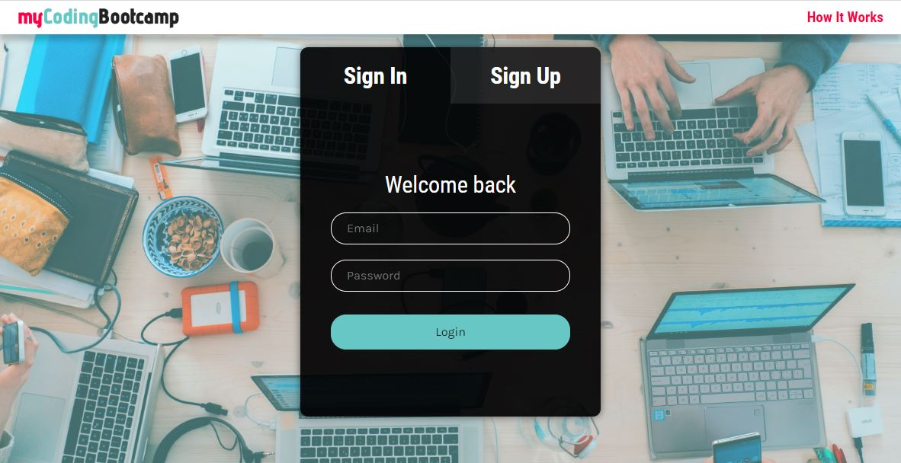
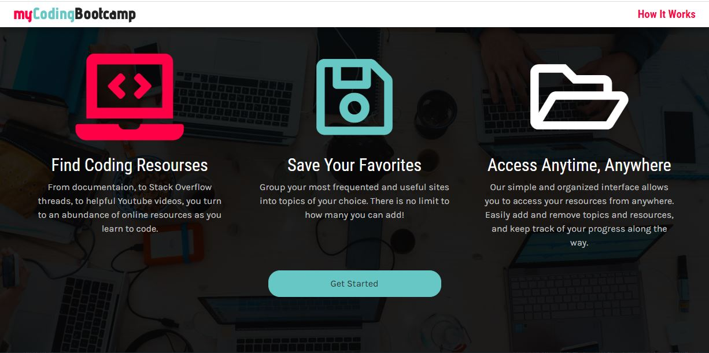
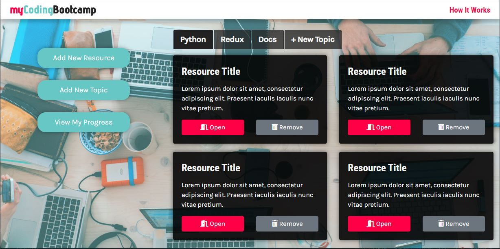
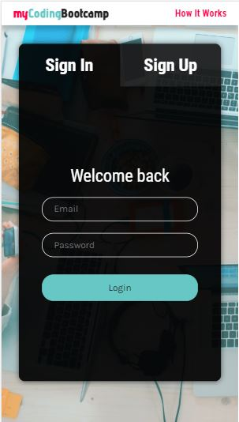

# My Coding Bootcamp (IN PROGRESS)

Create topics of interest, save online resources, keep track of progress, learn to code!

Built using the MERN stack (MongoDB, Express.js, React, and Node.js). I will also implement user login with password encryption and JSON Web Token authentication. Stay tuned!

## Description

With an abundance of coding resources online, from YouTube videos to documentation to Stack Overflow threads, it can be difficult to keep track of which ones you have already watched or read. As a new developer, I am constantly saving resources to the Bookmarks bar, but this is not the best solution for me. When I am on a different PC or mobile device, for example, I cannot browse through my bookmarked online resources. Even from my own machine, I cannot keep track of which ones I have already used, and it is not very visually engaging.

Enter _My Coding Bootcamp_, an application where users can create accounts and save/group their favorite online coding resources into topics of their choice. Users can log in at any time to practice, and after utilizing one of their saved resources, they can mark it as complete in order to keep track of their progress.

## Screenshots

#### Desktop

#### Mobile

## License

MIT License

Copyright (c) 2020 Jordyn Saltzman

Permission is hereby granted, free of charge, to any person obtaining a copy of this software and associated documentation files (the "Software"), to deal in the Software without restriction, including without limitation the rights to use, copy, modify, merge, publish, distribute, sublicense, and/or sell copies of the Software, and to permit persons to whom the Software is furnished to do so, subject to the following conditions: The above copyright notice and this permission notice shall be included in all copies or substantial portions of the Software. THE SOFTWARE IS PROVIDED "AS IS", WITHOUT WARRANTY OF ANY KIND, EXPRESS OR IMPLIED, INCLUDING BUT NOT LIMITED TO THE WARRANTIES OF MERCHANTABILITY, FITNESS FOR A PARTICULAR PURPOSE AND NONINFRINGEMENT. IN NO EVENT SHALL THE AUTHORS OR COPYRIGHT HOLDERS BE LIABLE FOR ANY CLAIM, DAMAGES OR OTHER LIABILITY, WHETHER IN AN ACTION OF CONTRACT, TORT OR OTHERWISE, ARISING FROM, OUT OF OR IN CONNECTION WITH THE SOFTWARE OR THE USE OR OTHER DEALINGS IN THE SOFTWARE.
